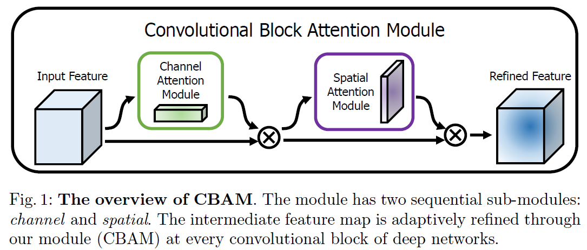
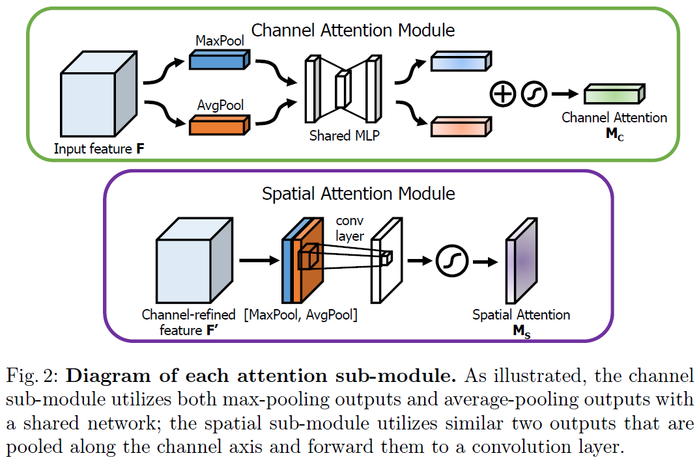
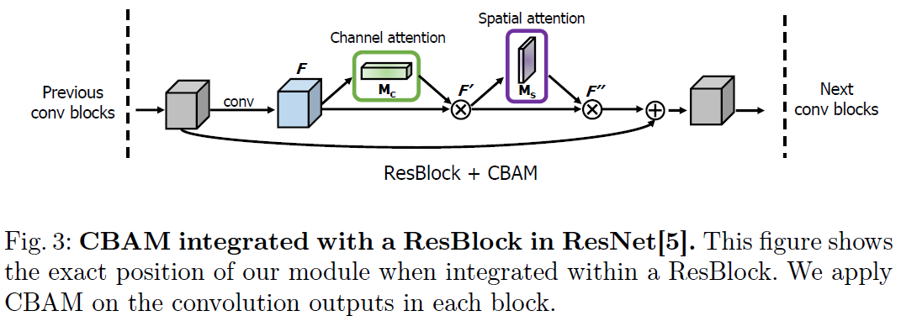

We plan to release one modified architecture implemented by MXNet for image classification

# CBAMnet.mxnet
A MXNet implementation of Modified CBAMnet

In this part, we implement a modified CBAMnet (**CBAM Resnet 100**) architecture via [MXNet](http://mxnet.io/). The original one is described in the paper [CBAM: Convoluational Block Attention Module](https://arxiv.org/pdf/1807.06521v2.pdf) proposed by [Sanghyun Woo](https://github.com/shwoo93), [Jongchan Park](https://github.com/Jongchan), Joon-Young Lee, and In So Kweon. This paper is accepted by ECCV 2018.

## Original architecture

This is an overview of a convolutional block attention module (CBAM).

Each attention sub-module is illustrated as following diagram:

The Residual building block integrated with CBAM is demonstrated as the following figure:

We implement the modified CBAMnet based on original CBAMnet 100 (ResNet 100 + CBAM).  
In our implementation, we use 1x1 convolution layer to replace the fully connected layer in MLP.

## What's the difference between modified version and original version ?
**1**. The size of input data is 112x112 not 224x224. In order to preserve higher feature map resolution, we follow the setting of input in [2]. Specifically, The first convolution layer with 7x7 kernel size and 2 stride is replaced by 3x3 kernel size and 1 stride. Moreover, 
we remove the following max pooling layer with 3x3 kernel size and 2 stride.

**2**. We adopt the improved residual unit mentioned in [2]. Specifically, the improved residual unit is constructed by BN-Conv-BN-PReLu-Conv-BN, where BN denotes batch normalization layer, PReLu is Parametric Rectified Linear Unit activation layer and Conv means convolution layer.

**3**. We replace all ReLu activation layers with PReLu activation layers in our whole architecture.

**4**. We follow the output setting mentioned in [2]. Specifically, we choose Option-E with structure of BN-Dropout-FC-BN after the last convolutional layer, where Dropout means dropout layer and FC denotes fully connected layer.

**This modified Convolutional Block Attention Module based Residual Network architecture can be directly integrated into the library of [insightface](https://github.com/deepinsight/insightface).**

## Reference

[1]  [Sanghyun Woo](https://github.com/shwoo93), [Jongchan Park](https://github.com/Jongchan), Joon-Young Lee, and In So Kweon. [CBAM: Convoluational Block Attention Module](https://arxiv.org/pdf/1807.06521v2.pdf) ECCV 2018.

[2] Jiankang Deng, [Jia Guo](https://github.com/deepinsight/insightface), Stefanos Zafeiriou. ["ArcFace: Additive Angular Margin Loss for Deep Face Recognition"](https://arxiv.org/pdf/1801.07698v1.pdf)

[3] Kaiming He, Xiangyu Zhang, Shaoqing Ren, Jian Sun. ["Identity Mappings in Deep Residual Networks"](https://arxiv.org/pdf/1603.05027v3.pdf)

[Pytorch implementation](https://github.com/Youngkl0726/Convolutional-Block-Attention-Module/blob/master/CBAMNet.py)
